<div align="center">

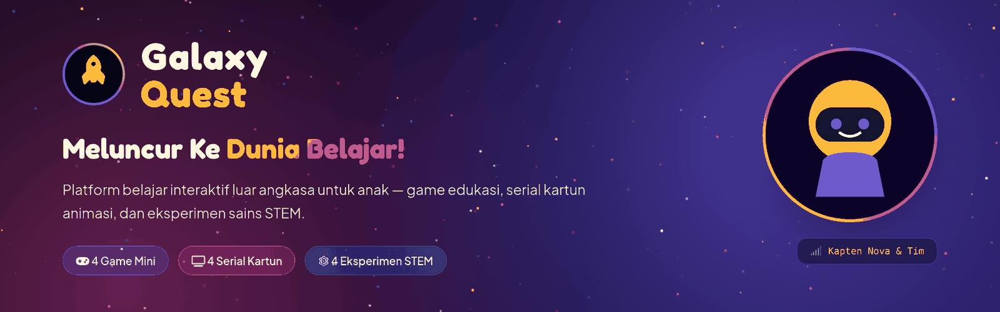

# 🚀 Galaxy Quest

**Platform belajar interaktif bertema luar angkasa untuk anak — game edukasi, serial kartun animasi, dan eksperimen sains STEM dalam satu halaman web.**

[](index.html)
[](https://tailwindcss.com)
[](https://tonejs.github.io)
[](LICENSE)
[](#)

[Tentang](#-tentang) · [Tangkapan Layar](#-tangkapan-layar) · [Fitur](#-fitur) · [Menjalankan](#-menjalankan-proyek) · [Lisensi](#-lisensi)

</div>

---

## 🌌 Tentang

**Galaxy Quest** mengubah rasa penasaran anak menjadi pengetahuan lewat petualangan
antariksa. Antarmuka memakai estetika *deep-space console* yang tenang dan profesional —
permukaan gelap berlapis, aksen emas untuk hadiah, serta ilustrasi vektor orisinal —
dipadukan maskot **Kapten Nova & Tim**, efek suara lembut, dan alur navigasi sederhana
yang tetap ramah anak.

Proyek ini sengaja dibuat sebagai **satu file `index.html` tanpa build step** — cukup
buka di browser, tanpa instalasi, tanpa database, dan tanpa backend.

<div align="center">
  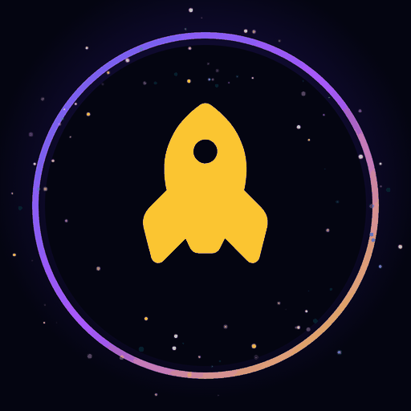
</div>

---

## 📸 Tangkapan Layar

### Beranda — Hero & Konsol Misi Kapten Nova

<div align="center">
  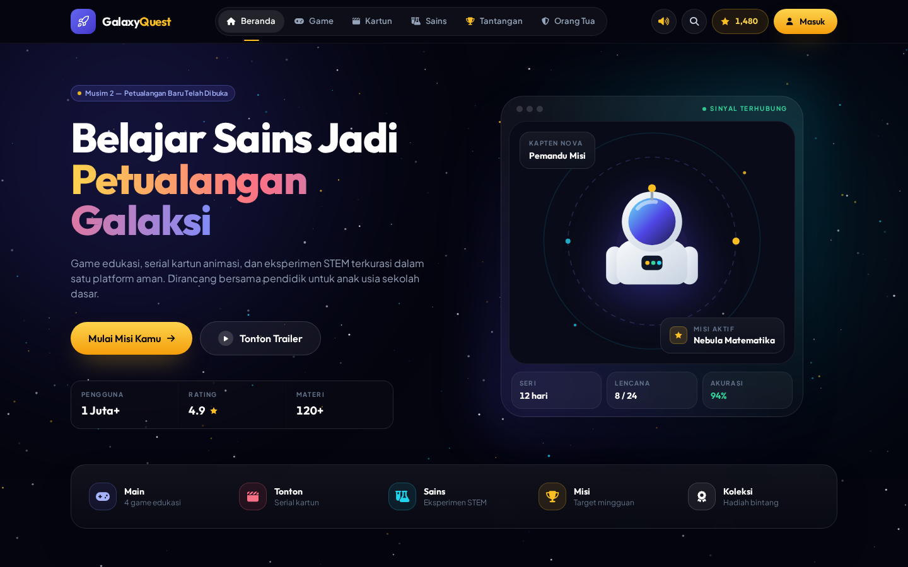
</div>

Halaman pembuka menampilkan ajakan *"Belajar Sains Jadi Petualangan Galaksi"*, panel
konsol misi dengan maskot Kapten Nova, strip metrik kepercayaan, serta bar aksi cepat
menuju **Main**, **Tonton**, **Sains**, **Misi**, dan **Koleksi**.

### Game Mini Edukasi

<div align="center">
  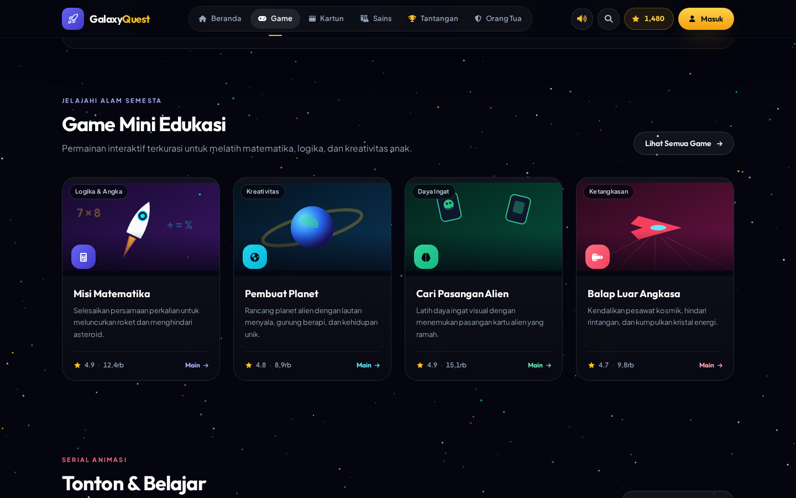
</div>

Empat permainan edukatif: **Misi Matematika**, **Pembuat Planet**, **Cari Pasangan
Alien**, dan **Balap Luar Angkasa**.

### Contoh Permainan — Misi Matematika

<div align="center">
  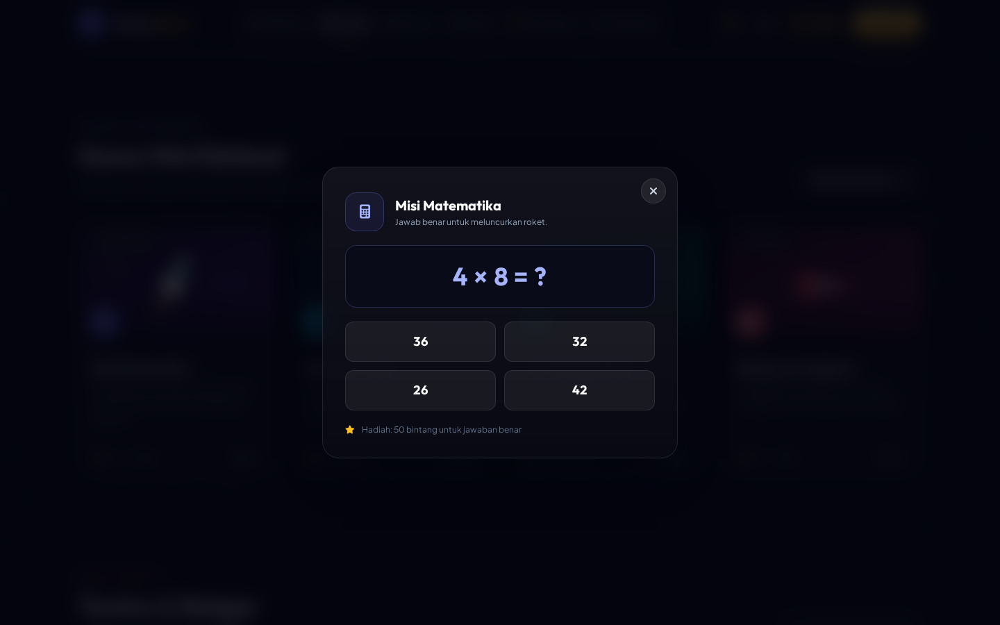
</div>

Soal perkalian dibuat acak setiap sesi. Jawaban benar memberi hadiah bintang yang
langsung menambah papan skor di header.

### Serial Kartun Animasi

<div align="center">
  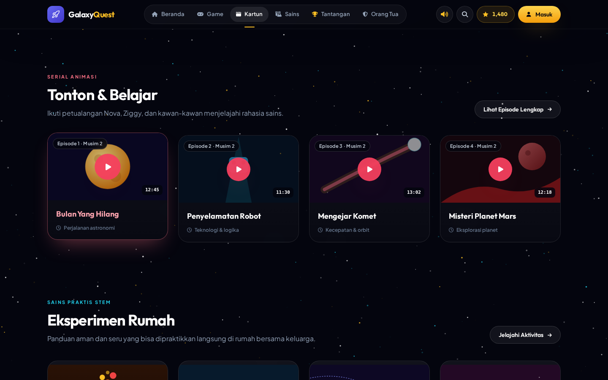
</div>

Empat episode serial: **Bulan Yang Hilang**, **Penyelamatan Robot**, **Mengejar
Komet**, dan **Misteri Planet Mars** — masing-masing dengan pemutar simulasi yang
ramah anak.

### Eksperimen Sains STEM

<div align="center">
  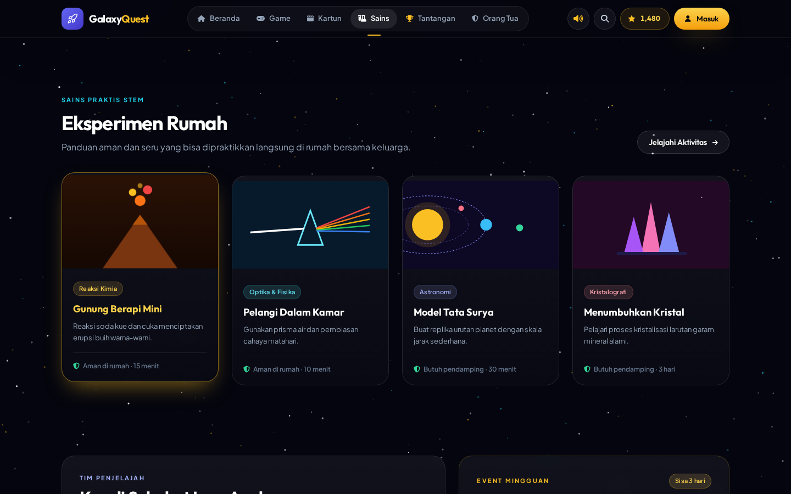
</div>

Panduan praktikum rumahan dengan daftar alat dan bahan: **Gunung Berapi Mini**,
**Pelangi Dalam Kamar**, **Model Tata Surya**, dan **Menumbuhkan Kristal**.

### Misi Mingguan

<div align="center">
  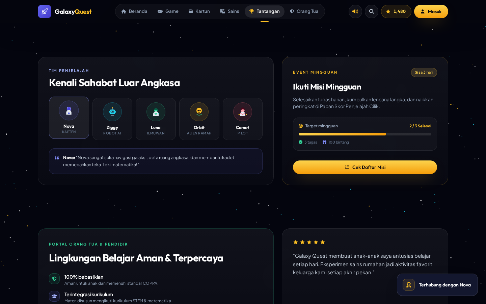
</div>

Progress bar misi, daftar tantangan, dan lencana penghargaan yang dapat diklaim
setelah target tercapai.

### Koleksi Bintang

<div align="center">
  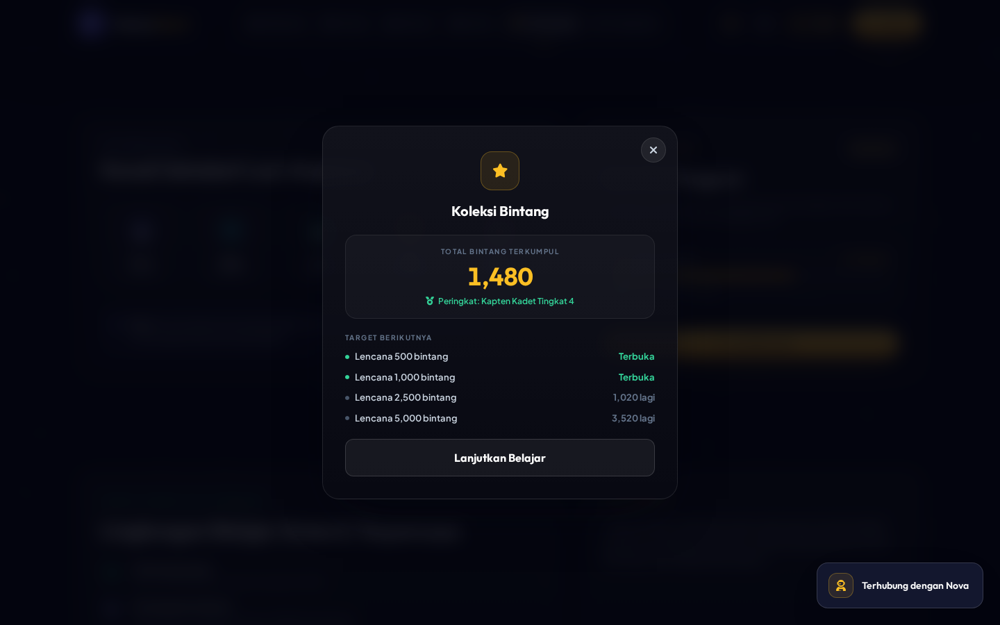
</div>

Papan koleksi yang menampilkan total bintang dan peringkat kadet.

### Portal Orang Tua & Pendidik

<div align="center">
  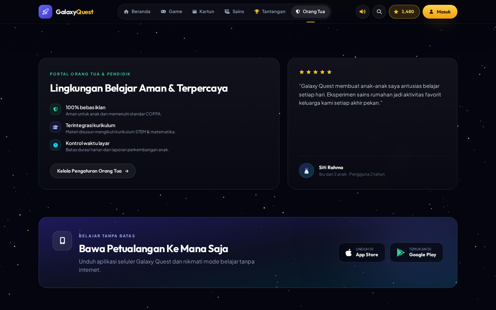
</div>

Panel khusus orang tua berisi jaminan lingkungan belajar, pembatasan durasi layar, dan
pengaturan pendampingan.

### Tampilan Seluler

<div align="center">
  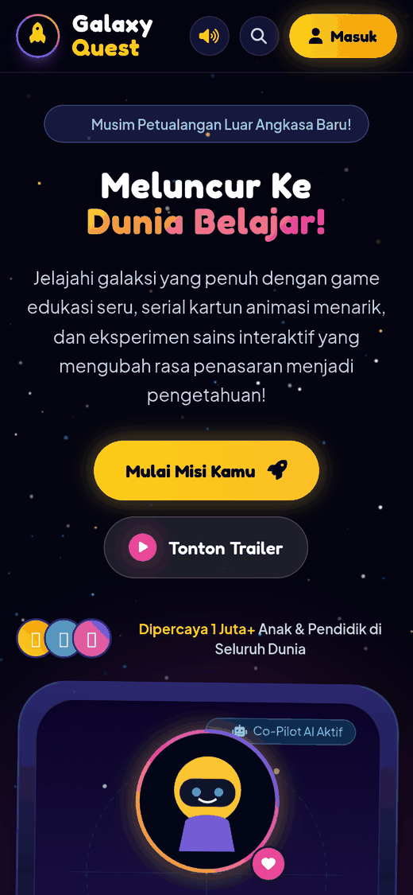
</div>

Sepenuhnya responsif — tata letak menyesuaikan dari ponsel hingga layar lebar.

---

## ✨ Fitur

| Bagian | Isi |
| --- | --- |
| 🎮 **Game Mini** | Misi Matematika, Pembuat Planet, Cari Pasangan Alien, Balap Luar Angkasa |
| 📺 **Kartun** | 4 serial animasi edukatif dengan simulasi pemutar |
| 🔬 **Sains** | 4 panduan eksperimen STEM rumahan (alat, bahan, langkah) |
| 🏆 **Tantangan** | Misi mingguan, progress bar, dan klaim lencana |
| ⭐ **Koleksi Bintang** | Papan skor bintang & peringkat kadet |
| 🛡️ **Portal Orang Tua** | Ringkasan keamanan, screen time, dan laporan |
| 🔊 **Efek Suara** | Sintesis audio via Tone.js dengan tombol nyala/mati |
| 🔍 **Pencarian** | Modal pencarian konten cepat |
| 🌠 **Starfield** | Kanvas latar bintang yang digambar secara prosedural |
| 👨‍🚀 **Kru Karakter** | Nova, Ziggy, Luna, Orbit, dan Comet |
| 📱 **Responsif** | Mobile-first, mendukung mode gelap secara bawaan |

### Detail interaksi

- Seluruh suara dibangkitkan **di sisi klien** memakai `Tone.Synth` — tidak ada berkas audio.
- Semua grafik dibuat dengan **SVG inline dan CSS gradien** — tidak ada berkas gambar eksternal.
- Kartu bertema *glassmorphism* dengan lift halus saat hover dan pendar warna per kategori.
- Ilustrasi maskot dan avatar kru digambar sebagai **SVG vektor**, bukan emoji, agar
  tampil konsisten di semua sistem operasi dan perangkat.

### Aksesibilitas

- Navigasi utama memakai **scroll-spy** yang menandai seksi aktif secara otomatis.
- Menu seluler dengan tombol hamburger, `aria-expanded`, dan `aria-controls`.
- Modal dapat ditutup lewat tombol **Escape**, klik latar, atau tombol tutup; fokus
  dipindahkan ke tombol tutup saat modal dibuka dan *scroll* halaman dikunci.
- Tautan **"Lewati ke konten utama"** untuk pengguna keyboard dan pembaca layar.
- Setiap elemen interaktif memiliki `aria-label`, indikator fokus yang terlihat, dan
  kontras teks minimal 7,9:1.
- Animasi otomatis dinonaktifkan saat pengguna mengaktifkan `prefers-reduced-motion`.

---

## 🧰 Teknologi

| Lapisan | Pustaka |
| --- | --- |
| Markup & gaya | HTML5 + [Tailwind CSS](https://tailwindcss.com) (CDN) + CSS kustom |
| Ikon | [Font Awesome 6.4](https://fontawesome.com) |
| Tipografi | [Google Fonts](https://fonts.google.com) — Outfit (display) & Plus Jakarta Sans (teks) |
| Audio | [Tone.js 14.8](https://tonejs.github.io) |
| Interaksi | Vanilla JavaScript (tanpa framework, tanpa bundler) |

**Tanpa** `npm install`, **tanpa** proses build, **tanpa** dependensi runtime backend.

---

## 🚀 Menjalankan Proyek

### Cara tercepat

Unduh repositori ini lalu buka `index.html` langsung di peramban:

```bash
git clone https://github.com/antono4/GalaxyQuest.git
cd GalaxyQuest
open index.html          # macOS
# start index.html       # Windows
# xdg-open index.html    # Linux
```

### Dengan server lokal (disarankan)

Menjalankan lewat server lokal membuat pemuatan CDN dan font lebih stabil:

```bash
python3 -m http.server 8000
# lalu buka http://localhost:8000
```

Atau dengan Node.js:

```bash
npx serve .
```

> **Catatan:** efek suara baru aktif setelah interaksi pertama pengguna, sesuai
> kebijakan autoplay Web Audio di peramban modern.

---

## 🌐 Publikasi ke GitHub Pages

1. Buka **Settings → Pages** pada repositori.
2. Pilih **Source: Deploy from a branch**.
3. Pilih branch **`main`** dan folder **`/ (root)`**.
4. Simpan, lalu situs terbit di `https://antono4.github.io/GalaxyQuest/`.

---

## 📁 Struktur Proyek

```
GalaxyQuest/
├── index.html                  # Seluruh aplikasi (markup, gaya, dan logika)
├── LICENSE                     # Lisensi MIT
├── README.md                   # Berkas ini
└── docs/
    ├── images/
    │   ├── banner.png          # Banner repositori
    │   └── logo.png            # Logo Galaxy Quest
    └── screenshots/            # Tangkapan layar aplikasi
        ├── 01-hero.png
        ├── 02-game-mini.png
        ├── 03-game-matematika.png
        ├── 04-kartun.png
        ├── 05-eksperimen-stem.png
        ├── 06-tantangan.png
        ├── 07-koleksi-bintang.png
        ├── 08-orang-tua.png
        └── 09-mobile.png
```

---

## 🎨 Menyesuaikan

Semua penyesuaian dilakukan di dalam `index.html`.

**Palet warna** — design token didefinisikan di blok `tailwind.config`. Warna
dikelompokkan per peran agar konsisten: `ink` (permukaan netral), `brand` (aksi
utama), `sun` (hadiah & CTA), `aqua` (sains), `coral` (kartun), `mint` (status aman).

```js
colors: {
  ink:   { 950: '#04050e', 900: '#090b18', 800: '#141830' }, // latar & kartu
  brand: { 400: '#818cf8', 500: '#6366f1', 700: '#4338ca' }, // aksi utama
  sun:   { 300: '#fcd34d', 400: '#fbbf24', 500: '#f59e0b' }, // bintang & tombol utama
  aqua:  { 400: '#22d3ee', 500: '#06b6d4' },                 // eksperimen sains
  coral: { 400: '#fb7185', 500: '#f43f5e' },                 // serial kartun
  mint:  { 400: '#34d399', 500: '#10b981' },                 // status aman
}
```

Gaya komponen yang dipakai ulang (`.btn`, `.card`, `.chip`, `.nav-link`, `.icon-tile`,
dan varian hover seperti `.hover-brand`) didefinisikan sekali di blok
`<style type="text/tailwindcss">` dengan directive `@apply`, sehingga komponen baru
otomatis mengikuti sistem desain yang sama.

**Menambah game baru** — tambahkan kartu pada `<section id="games">`, lalu daftarkan
penanganannya di objek `Games`:

```js
const Games = {
  launch(type) {
    if (type === 'math') this.startMathGame();
    else if (type === 'planet') this.startPlanetBuilder();
    // tambahkan tipe baru di sini
  }
};
```

**Menambah konten kartun atau eksperimen** — ikuti pola kartu yang sudah ada di dalam
`<section id="cartoons">` dan `<section id="activities">`, lalu sambungkan ke
`Modals.playCartoon()` atau `Modals.openActivity()`.

---

## 🔐 Privasi & Keamanan

- Tidak ada backend, tidak ada permintaan jaringan ke server pihak ketiga selain CDN
  aset (Tailwind, Font Awesome, Google Fonts, Tone.js).
- **Tidak ada** `localStorage`, cookie, atau pelacakan apa pun — bintang dan progres
  misi hanya tersimpan di memori selama halaman terbuka dan kembali ke nilai awal
  saat dimuat ulang.
- Tidak ada formulir yang mengirim data; modal "Masuk" dan "Unduh aplikasi" bersifat
  simulasi antarmuka.
- Orang tua atau pendidik yang ingin memakai versi sepenuhnya luring dapat mengunduh
  pustaka CDN di atas secara lokal lalu mengubah atribut `src`/`href` pada `<head>`
  untuk menunjuk ke berkas lokal.

---

## 🤝 Berkontribusi

Kontribusi sangat diterima:

1. *Fork* repositori ini.
2. Buat branch fitur: `git checkout -b fitur/nama-fitur`.
3. Lakukan perubahan pada `index.html` beserta tangkapan layar terkait di `docs/`.
4. *Commit*: `git commit -m "Tambah fitur ..."`.
5. Buka *Pull Request*.

Untuk perbaikan tampilan, mohon sertakan tangkapan layar sebelum dan sesudah.

---

## 📄 Lisensi

Dirilis di bawah **Lisensi MIT** — lihat berkas [LICENSE](LICENSE) untuk teks lengkap.

Artinya Anda bebas memakai, menyalin, mengubah, menggabungkan, menerbitkan,
mendistribusikan, mensublisensikan, dan/atau menjual salinan perangkat lunak ini,
selama pemberitahuan hak cipta dan izin berikut disertakan pada semua salinan.

---

<div align="center">

Dibuat dengan 🚀 untuk para penjelajah kecil.

**Selamat menjelajah, Kapten Kadet!**

</div>
